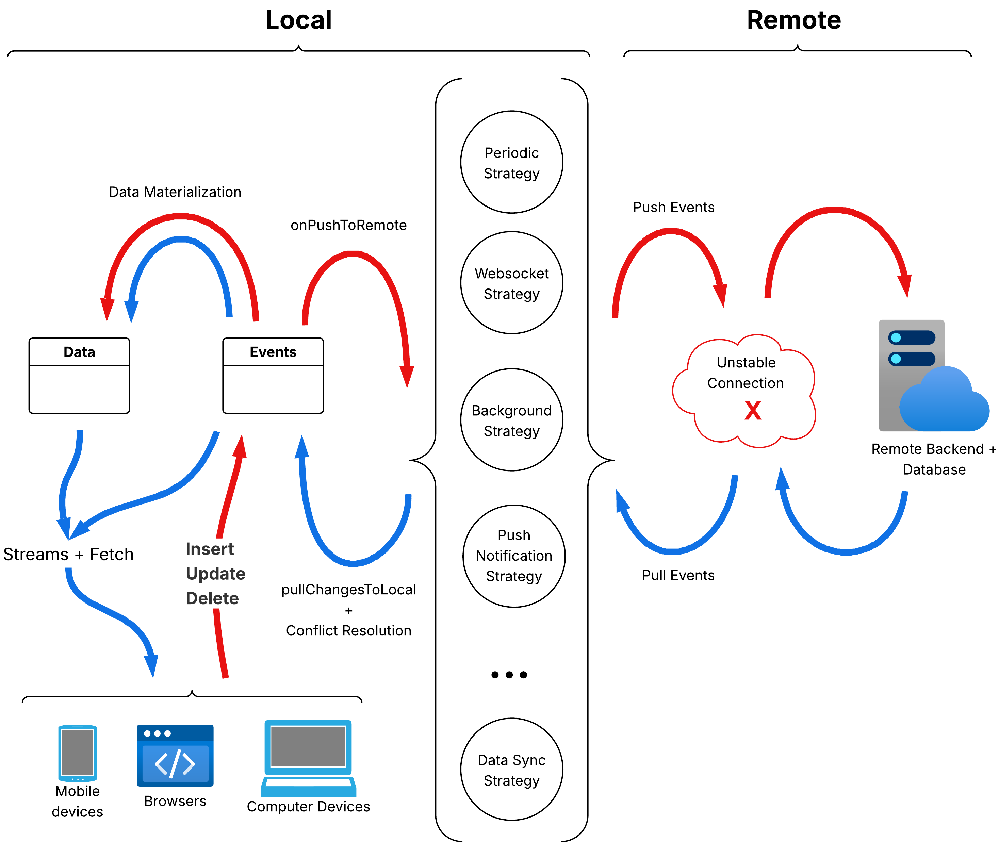

# Local First

[](#)
[](https://discord.awesome-notifications.carda.me)

[](#)
[](https://pub.dev/packages/local_first)

[](https://codecov.io/github/rafaelsetragni/local_first)

<br>

Local-first data layer for Flutter applications that keeps your data available offline and synchronizes data on live using multiple strategies when the network returns.


This solution is 100% self hosted and low bandwith. It can be customized combining the usage of multiple packages, such as:

- [`local_first`](https://pub.dev/packages/local_first): core client, repositories, in memory storages, sync contracts and common utilities.
- [`local_first_hive_storage`](https://pub.dev/packages/local_first_hive_storage): Hive adapter (schema-less boxes).
- [`local_first_sqlite_storage`](https://pub.dev/packages/local_first_sqlite_storage): SQLite adapter (structured tables with indexes).
- [`local_first_periodic_strategy`](https://pub.dev/packages/local_first_periodic_strategy): Periodic data sync strategy for robust periodic fetches.
- [`local_first_websocket`](https://pub.dev/packages/local_first_websocket): Websocket data sync strategy for live communication.


> Status: early preview. The package is in active development (final stages) and the public API may change before the first stable release. Use the examples below as guidance for the intended design.

## Why local_first?

Local-first strategy allows your remote devices to work independently of the network connection and, at the same time, allows those devices to seamlessly synchronize with the remote when the connection is available. This turns your application:

1. **Always available and ready for usage:** even with no network connection—networks can drop at any moment, even inside signal-shadow zones.

2. **Fast synchronization between devices:** synchronization flows continuously without requiring long, heavy processes.

3. **Backend-agnostic:** integrate it easily with any backend technology, even pre-existing ones.

4. **Minimum boilerplate:** all synchronization intelligence is handled by the package so you focus on your business logic.

## Local-first principles

Local-first apps give users instant feedback by reading and writing to the device first, even with no network. The sync layer runs in the background: when connectivity returns, queued changes are pushed and remote updates are pulled. Your UI never blocks on the server; the storage delegate is the primary interface your repositories talk to.

## Source of truth

During a session, the local database is the active source of truth. Remote systems are reconciled via pull/push cycles orchestrated by your sync strategy, and per-user namespacing works like internal and independent databases, keeping data domains isolated.



The events table is the canonical history. Every mutation becomes an event (`event_id` + `created_at`, both UUID v7-based), which is pushed upstream; downstream clients pull those events to converge on eventual consistency. Multiple sync strategies can run in parallel, and idempotency is enforced by event identifiers so duplicates are ignored, not reapplied.

The data tables store the current materialized state derived from that event stream. Storage plugins hydrate them from the normalized event history while remaining compatible with any existing schema, so you never need to drop or recreate tables—just replay the events and let the data tables stay responsive for local reads/writes.

## Conflict resolution

Plan your data model to avoid hotspots: prefer append-only logs, split records so multiple writers don’t touch the same row, and keep timestamps in UTC. The best strategy is to design your model so conflicts simply cannot happen.

For example, the bundled [counter_app demo](../counter_app) feels like a single shared counter to the user, but it is implemented as the sum of independent per-user/device registers. Each namespace owns its own row, syncs independently, and the UI simply aggregates those values. Because no global row is rewritten, there is nothing to conflict against, and the sync layer never has to resolve concurrent writes.

If concurrent edits still happen, plug in resolution rules per repository—last-write-wins, timestamp comparison, or custom merge callbacks—to decide which state should prevail when syncing.

### Conflict resolution modes

- **Last-write-wins (LWW):** pick the event with the latest `updated_at` (or another monotonic field).
- **Timestamp comparison:** prefer remote/local based on creation/update timestamps.
- **Custom resolver:** implement domain-specific merge logic (e.g., merge maps, sum counters, reconcile lists).

Example: registering LWW with `onConflict` when creating a repository:

```dart
final todoRepository = LocalFirstRepository<Todo>.create(
  name: 'todo',
  getId: (todo) => todo.id,
  toJson: (todo) => todo.toJson(),
  fromJson: Todo.fromJson,
  onConflictEvent: (local, remote) {
    final localUpdated = local.data.updatedAt;
    final remoteUpdated = remote.data.updatedAt;
    return remoteUpdated.isAfter(localUpdated) ? remote : local;
  },
);
```

## Server sync index

Keep a remote cursor per repository (commonly `server_sequence` or `server_created_at`) so pulls fetch only new/changed events. Store this cursor in config/meta storage and advance it after each successful pull; this keeps sync idempotent and efficient when talking to any backend API.

## Example app overview

The bundled demo is a multi-user, namespaced counter with user profiles and session counters. It shows repositories talking to storage, config/meta reads/writes, and a sync strategy exchanging events with a mock backend. Use it as a blueprint for wiring your own models and strategies.

## Running the examples

Each adapter ships the same demo. Choose the storage you want to explore and run:

- `local_first/example` (in-memory for dev)
- `local_first_hive_storage/example` (Hive storage)
- `local_first_sqlite_storage/example` (SQLite storage)
- `local_first_shared_preferences/example` (config-only storage)

From inside the chosen folder: `flutter run`.

## Features

- Offline-first caching with automatic retry when connectivity is restored.
- Typed repositories for common CRUD flows.
- Conflict handling strategies (last-write-wins, timestamps, and custom resolution hooks).
- Background sync hooks for push/pull cycles.
- Encryption-ready storage layer by leveraging your chosen database/provider.
- Dev-friendly: simple configuration, verbose logging, and test utilities.

## Installation

Add the dependency to your `pubspec.yaml`:

```yaml
dependencies:
  local_first: ^0.6.0
  local_first_hive_storage: ^0.2.0  # optional
  local_first_sqlite_storage: ^0.2.0 # optional
  local_first_shared_preferences: ^0.1.0 # optional (config storage only)
```

Then install it with:

```bash
flutter pub get
```

## Quick start

The API is evolving, but the intended flow looks like this:

```dart
import 'package:local_first/local_first.dart';

// 1) Describe your model (no mixin needed). LocalFirstEvent will wrap it with
//    sync metadata. Keep your dates in UTC.
class Todo {
  const Todo({
    required this.id,
    required this.title,
    this.completed = false,
    required this.updatedAt,
  });

  final String id;
  final String title;
  final bool completed;
  final DateTime updatedAt;

  JsonMap toJson() => {
        'id': id,
        'title': title,
        'completed': completed,
        'updated_at': updatedAt.toUtc().toIso8601String(),
      };

  factory Todo.fromJson(JsonMap json) => Todo(
        id: json['id'] as String,
        title: json['title'] as String,
        completed: json['completed'] as bool? ?? false,
        updatedAt: DateTime.parse(json['updated_at']).toUtc(),
      );

  // Last write wins.
  static Todo resolveConflict(Todo local, Todo remote) =>
      local.updatedAt.isAfter(remote.updatedAt) ? local : remote;
}

// 2) Create a repository for the model.
final todoRepository = LocalFirstRepository<Todo>.create(
  name: 'todo',
  getId: (todo) => todo.id,
  toJson: (todo) => todo.toJson(),
  fromJson: Todo.fromJson,
  onConflictEvent: (local, remote) {
    final resolved = Todo.resolveConflict(local.data, remote.data);
    return identical(resolved, local.data) ? local : remote;
  },
);

Future<void> main() async {
  // 3) Wire up local storage plus your sync strategy.
  final client = LocalFirstClient(
    repositories: [todoRepository],
    // Choose your adapter (add dependency and import it):
    // import 'package:local_first_hive_storage/local_first_hive_storage.dart';
    // import 'package:local_first_sqlite_storage/local_first_sqlite_storage.dart';
    localStorage: HiveLocalFirstStorage(), // or SqliteLocalFirstStorage()
    syncStrategies: [
      // Provide your own strategy that implements DataSyncStrategy.
      MyRestSyncStrategy(),
    ],
  );

  await client.initialize();

  // 4) Use the repository as if you were online the whole time.
  //    LocalFirstEvent is created internally and keeps sync metadata immutable.
  await todoRepository.upsert(
    Todo(id: '1', title: 'Buy milk', updatedAt: DateTime.now().toUtc()),
    needSync: true,
  );

  // served instantly from local cache
  final todoStream = todoRepository.query().orderBy('title').watch();

  // 5) Let your strategy push/pull, or trigger manually when it makes sense.
  // await client.sync();
}
```

### Choose your storage backend

- **Hive**: schema-less, fast key/value boxes. Add `local_first_hive_storage` and use `HiveLocalFirstStorage()` (default in the basic example).
- **SQLite**: structured tables with indexes for query filters/sorts. Add `local_first_sqlite_storage` and use `SqliteLocalFirstStorage()`, providing a schema when creating repositories:

```dart
final todoRepository = LocalFirstRepository<Todo>.create(
  name: 'todo',
  getId: (todo) => todo.id,
  toJson: (todo) => todo.toJson(),
  fromJson: Todo.fromJson,
  onConflict: Todo.resolveConflict,
  schema: const {
    'title': LocalFieldType.text,
    'completed': LocalFieldType.boolean,
    'updated_at': LocalFieldType.datetime,
  },
);
final client = LocalFirstClient(
  repositories: [todoRepository],
  localStorage: SqliteLocalFirstStorage(),
  syncStrategies: [MyRestSyncStrategy()],
);
```

## Example app

A starter Flutter app lives in `example/` and showcases the local-first flow to increment or decrement a global shared counter (per-user namespaces, repositories, and a Mongo sync mock).

```bash
# Clone and fetch deps
git clone https://github.com/rafaelsetragni/local_first.git
cd local_first
flutter pub get

# Run the sample
cd example
flutter pub get
flutter run

# (Optional) Start the Mongo mock used by the sync strategy.
# docker run -d --name mongo_local -p 27017:27017 \\
#   -e MONGO_INITDB_ROOT_USERNAME=admin \\
#   -e MONGO_INITDB_ROOT_PASSWORD=admin mongo:7
```

## Roadmap

- [X] Simple chat application example at repository.
- [X] Simple global concurrent counter application example at repository.
- [X] Implement SQLite storage adapters via add-on packages.
- [X] Implement Hive storage adapters via add-on packages.
- [X] Provide Periodic REST and WebSocket sync strategies via add-on packages.
- [X] End-to-end sample app with authentication.
- [X] Comprehensive docs and testing utilities (models now use `LocalFirstModel` mixin; full test coverage added).
- [ ] Background sync helpers for Android/iOS via add-on packages.

## Contributing

Contributions are welcome! Please open an issue to discuss ideas or bugs, and feel free to submit pull requests once we agree on the approach. Running the test suite before sending changes helps keep the package stable:

```bash
flutter test
```

## License

This project is available under the MIT License. See `LICENSE` for details.
